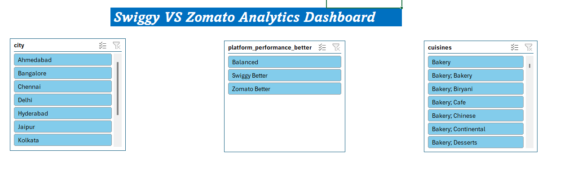
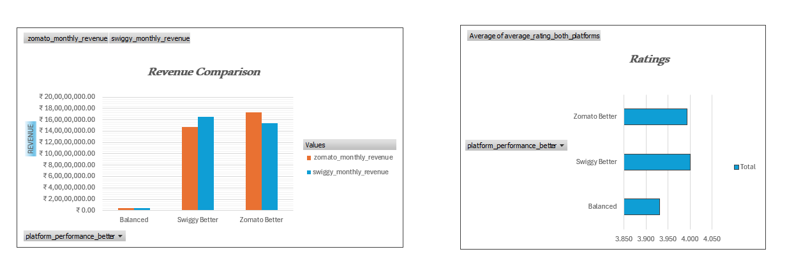
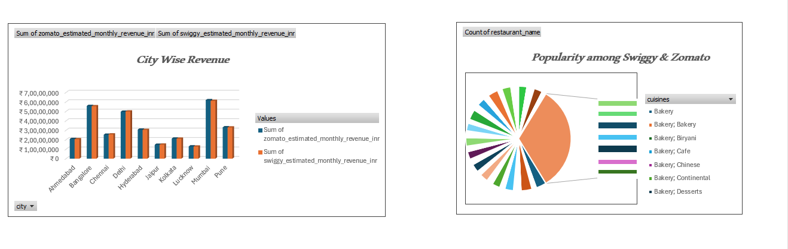
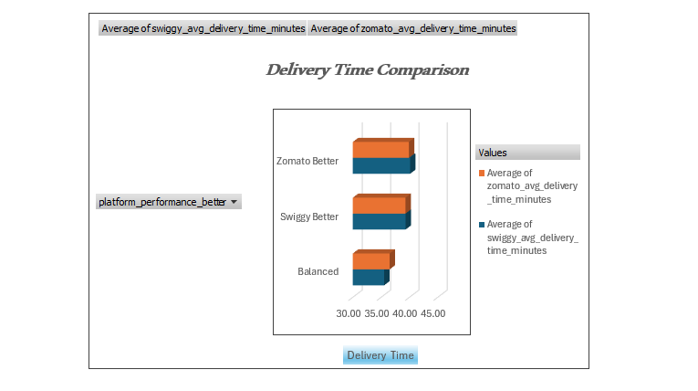

# Swiggy vs Zomato Analytics Dashboard

## Project Overview

This repository showcases my personal **Swiggy vs Zomato Analytics Dashboard**, developed using Microsoft Excel. The project focuses on analyzing restaurant and delivery data to compare the performance of both food delivery platforms. Through interactive dashboards, I transformed raw data into meaningful business insights, enabling data-driven decision-making.

## Key Objectives

* **Data Exploration:** Cleaned and organized restaurant datasets to ensure accurate analysis.
* **Comparative Analysis:** Evaluated Swiggy and Zomato based on revenue, customer ratings, delivery performance, and cuisine trends.
* **Business Intelligence:** Designed an interactive dashboard to visualize KPIs and platform performance.
* **Insight Generation:** Identified trends and patterns to support business and operational decisions.

## Tech Stack & Methodology

* **Data Analysis:** Microsoft Excel
* **Data Modeling:** Pivot Tables & Pivot Charts
* **Dashboard Design:** Interactive Slicers, KPIs & Dynamic Visualizations
* **Analytics Techniques:** Comparative Analysis, Trend Analysis & Performance Evaluation

## Dashboard Preview

##	Interactive Slicer

 

## Excel Dashboard View

   
   
   
                            
## Key Dashboard Insights

* Revenue comparison between Swiggy and Zomato
* Customer ratings analysis
* City-wise restaurant performance
* Cuisine popularity analysis
* Delivery performance comparison
* Interactive filtering using slicers
* Dynamic charts for business insights

## Core Competencies Demonstrated

Through this project, I strengthened practical data analytics skills by:

* **Data Cleaning & Preparation:** Structured raw restaurant data for accurate reporting.
* **Dashboard Development:** Built an interactive Excel dashboard using Pivot Tables, Charts, and Slicers.
* **Business Analysis:** Compared platform performance through KPIs and trend analysis.
* **Data Visualization:** Presented complex information using intuitive and interactive visuals.
* **Analytical Thinking:** Derived actionable insights from business data to support decision-making.

## Learning Outcomes

* Developed an end-to-end Excel analytics project from raw data to dashboard.
* Improved proficiency in Excel Pivot Tables, Pivot Charts, and Slicers.
* Enhanced skills in KPI reporting and business data visualization.
* Gained hands-on experience creating interactive dashboards for real-world business scenarios.

## Author

**Fousiya Fathima**  
*Aspiring Data Analyst*

> Passionate about transforming raw data into meaningful insights through data visualization and business analytics.
